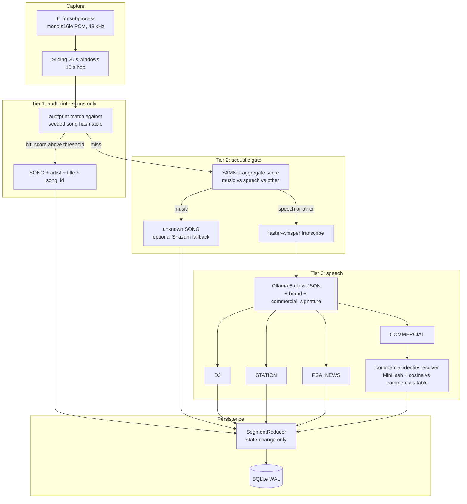

# Local Terrestrial Radio Classifier — Specification

**Status:** draft v1 — spec-driven, no production code yet
**Forked from:** [`live105sux`](../live105sux/) (5 of 6 phases shipped)
**Target station:** 105.3 FM (configurable)

---

## 1. Purpose

Build an offline-first pipeline that listens to an over-the-air FM
broadcast, attributes each contiguous slice of airtime to one of five
classes, and persists timestamps + brand metadata into SQLite so that
station programming, ad load, and brand frequency can be queried over
arbitrary time windows.

The system is for **the operator-analyst** ("radio forensics"), not a
public consumer app.

### 1.1 Primary success metrics

| Metric | Target |
|---|---|
| Song identification recall (known rotation) | **≥ 90 %** on a held-out FM-captured eval set |
| Tier 3 latency per SPEECH window (Whisper medium.en + Ollama 3B/8B Q4 on RTX 2080 Ti) | **≤ 5 s wall-clock per 20 s window** (i.e. faster than the hop) |
| Commercial signature precision (same `commercial_id` → genuinely same ad) | **≥ 0.95** on a hand-labelled corpus of 200 segments |
| State-machine timeline correctness (sum of durations vs wall clock) | **±2 %** error over a 24 h capture |

### 1.2 Non-goals (v1)

- **Cloud STT or cloud LLM** of any kind.
- **Multi-station / multi-tuner** fleet.
- **Web UI / dashboard** of any kind.
- **CSV, JSON, or HTML exports.** v1 ships only CLI subcommands that
  print human-readable tables to stdout. Direct SQLite access is
  documented for power users.
- **Commercial audio fingerprinting.** Tier 1 indexes songs only.
- **Real-time alerting / streaming output.** v1 is batch + tailed log.

---

## 2. Environment

### 2.1 Host

- **Windows 10** (build 19044/21H2 or later) running **WSL 2** (Ubuntu).
- **NVIDIA RTX 2080 Ti**, 11 GB VRAM, Turing (sm_75).
- Recent NVIDIA Game Ready / Studio driver on Windows (CUDA-in-WSL is
  GA from R470+).
- **`wsl --update`** kept current; the CUDA Toolkit for WSL installed
  inside the distro (`cuda-toolkit-wsl-ubuntu`, **not** the Linux
  display driver).
- **`nvidia-smi`** run inside WSL must list the **GeForce RTX 2080 Ti**
  before any ML phase begins.

### 2.2 Hardware passthrough

- **RTL-SDR USB dongle** attached via **`usbipd-win`** from Windows to
  WSL. Same flow as `live105sux`; unchanged.
- **GPU passthrough** via `/dev/dxg` — provided automatically by WSL
  once the CUDA toolkit is installed. No extra config.

### 2.3 Software stack

| Layer | Pin / Source | Notes |
|---|---|---|
| Python | **3.10 +** (3.12 OK) | Same as `live105sux` |
| `rtl_fm` | `rtl-sdr` Ubuntu package or upstream build | On PATH |
| `audfprint` | External CLI from <https://github.com/dpwe/audfprint> | Pure Python + numpy + scipy; not packaged for pip, discovered on PATH or via `RADIO_CLASSIFIER_AUDFPRINT_BIN` |
| Tier-2 acoustic | **`tensorflow-hub` + YAMNet** (default) *or* `panns-inference` (alt) | Chosen via `--tier2-backend` |
| `faster-whisper` | ≥ 1.0; CTranslate2 ≥ 4.x | `medium.en` on GPU (`device=cuda`, `compute_type=float16`) by default |
| `ctranslate2` | CUDA 12 build | Auto-installed with `faster-whisper[cuda]` |
| **Ollama** | <https://ollama.com>, installed once and run as a service inside WSL | Default model: **`llama3.2:latest`** (config'd via env / CLI) |
| `shazamio` | optional extra (`pip install radio-classifier[shazam]`) | Used only when `--enable-shazam` |
| `pydantic` | ≥ 2 | Schema validation |
| `numpy`, `scipy` | as inherited | DSP + resampling |
| `datasketch` | for **MinHash** of commercial transcripts | Pure-Python, deterministic |
| `yt-dlp` | optional extra (`[seeding]`) | Never imported by runtime path |
| `beautifulsoup4` + `requests` | optional extra (`[seeding]`) | Tracklist scraper only |

### 2.4 VRAM budget (RTX 2080 Ti, 11 GB)

| Module | Footprint | Always loaded? |
|---|---|---|
| YAMNet on GPU | ~100 MB | Yes (single process load) |
| `faster-whisper` medium.en, float16 | ~1.5–2 GB | Yes |
| Ollama (separate process, llama3.2 3B or 8B Q4_K_M) | ~2–6 GB | Yes |
| CUDA workspace + overhead | ~1 GB | — |
| **Headroom** | **~1 GB** | safety margin |

If headroom proves insufficient on real workloads, fall back to
`small.en` Whisper or `phi3:mini` Ollama.

### 2.5 GPU smoke test (Phase D pre-flight)

Phase D includes a `radio-classifier prereq-check --gpu` subcommand
that prints, in order:

1. `nvidia-smi` summary (driver version, free VRAM).
2. `python -c "import ctranslate2; print(ctranslate2.get_cuda_device_count())"` ≥ 1.
3. A 0.5-second `WhisperModel("tiny", device="cuda", compute_type="float16").transcribe(...)` round-trip on a 1-second sine WAV.
4. `curl http://127.0.0.1:11434/api/tags` — confirms Ollama is up.

The CLI exits non-zero if any check fails.

---

## 3. Architecture — the 3-tier funnel



### 3.1 Tier 1 — Local audio fingerprinting (songs only)

- **Engine:** `audfprint` (Dan Ellis), landmark-pair fingerprinting,
  pickle/SQLite hash-table backed. Replaces the original plan's choice
  of Dejavu (unmaintained, MySQL-centric, broken on Python 3.12+).
- **Indexed assets:** the 100–200 song reference set, seeded once via
  the toolchain in §6. `asset_type = 'song'` is the **only** Tier-1
  asset type. Commercials are **not** fingerprinted.
- **Match criteria:** `audfprint match` against the live window's WAV
  with `--min-count` and `--match-win` tuned in Phase J to clear the
  90 % recall gate on the eval corpus. Default starting values:
  `--min-count 5`, `--match-win 2`, `--density 20`.
- **Output:** on hit, `(song_id, artist, title, match_score)`. On miss,
  the window falls through to Tier 2.
- **Failure mode:** If audfprint raises or the index is missing, log
  once at process start and **skip Tier 1** for the run — the funnel
  degrades gracefully to Tier 2 + Tier 3.

### 3.2 Tier 2 — Acoustic classifier (music / speech / other)

- **Engine:** YAMNet via `tensorflow-hub`. Inference on GPU; one-time
  load at process start. Alternative `panns-inference` selectable via
  `--tier2-backend panns`.
- **Input:** the same 20 s int16 PCM window, resampled to 16 kHz mono
  (reuse `vad/resample.py` from `live105sux` verbatim).
- **Output mapping:** YAMNet emits 521 AudioSet logits. We sum
  per-class probabilities across the window's ~40 frames, then group:
  - **`MUSIC`** = `Music` and all its descendant labels
    (`Pop music`, `Rock music`, etc.).
  - **`SPEECH`** = `Speech`, `Male speech, man speaking`,
    `Female speech, woman speaking`, `Narration, monologue`,
    `Conversation`.
  - **`OTHER`** = everything else (`Silence`, `Static`, `Beep, bleep`,
    sound effects, etc.).
  - **Routing rule:** label = argmax across the three groups with a
    floor of `--tier2-min-prob` (default 0.25). On a flat distribution
    below the floor, default to `SPEECH` so it can be transcribed.
- **Caveat documented:** YAMNet was trained on AudioSet which is not
  FM-radio-tuned. We do **not** rely on Tier-2 fine class names — only
  the 3-way roll-up. Acceptable to misroute "DJ over music bed" as
  `MUSIC`; downstream behaviour is "unknown song" which is benign.
- **DJ-talk-over-music caveat:** when both `Speech` and `Music`
  probabilities are non-trivial (both > 0.3 of summed mass), prefer
  `SPEECH` and let Tier 3 sort it out. Captured in `--tier2-speech-bias`
  flag (default `on`).

### 3.3 Tier 3 — Whisper + Ollama (runs on every SPEECH or OTHER window)

- **Transcribe:** `faster-whisper` `medium.en`, `device=cuda`,
  `compute_type=float16`, `language=en`. (Configurable via the same
  flags inherited from `live105sux`.)
- **Classify:** Ollama HTTP `POST /api/chat` with a system prompt that
  enforces a JSON-only response matching the schema in §4.3. Pydantic
  validates; 3 retries on parse/validation error (logic harvested from
  `live105sux/src/live105sux/speech/ollama.py`).
- **Identity:**
  - `SONG`, `DJ`, `STATION`, `PSA_NEWS` → segment key uses the class
    plus a normalized dominant `brand_key` if any.
  - `COMMERCIAL` → the result is passed through the **commercial
    identity resolver** (§5) to obtain a stable `commercial_id`
    *before* the reducer keys the segment.

### 3.4 Optional Shazam fallback (`--enable-shazam`)

When Tier 1 misses **and** Tier 2 says `MUSIC`, optionally call
`shazamio` exactly as `live105sux` does today
(`live105sux/src/live105sux/music/identify.py`). Default **off** for
the "100 % local" story. When enabled:

- Inherits the existing dedupe + change-gate + rate-limit logic from
  `live105sux/src/live105sux/music/`.
- Matches are recorded as `SONG` segments with `song_id = NULL` and
  a `source = 'shazam'` column (see §4) — they do not populate the
  Tier-1 index automatically.

---

## 4. Data model

### 4.1 Migration story

The `live105sux` schema today
(`live105sux/db/schema.sql`) has a single table `broadcast_events` with
`category IN ('MUSIC', 'DJ', 'AD')`. The migration to **schema v2** is
performed by a one-shot `radio-classifier migrate-from-live105sux` CLI
subcommand:

1. Read every row from the old `broadcast_events` table.
2. Map `MUSIC` → `SONG`, `DJ` → `DJ`, `AD` → `COMMERCIAL`.
3. Insert into the new `broadcast_events` (5-class enum).
4. For `COMMERCIAL` rows with a non-null `brand_name`, ensure a `brands`
   row exists and populate `brand_id`. `commercial_id` remains NULL for
   historical rows (no signature available retroactively).
5. New databases skip migration and start fresh.

### 4.2 Schema v2 (DDL)

```sql
PRAGMA foreign_keys = ON;

CREATE TABLE IF NOT EXISTS schema_meta (
    key TEXT PRIMARY KEY,
    value TEXT NOT NULL
);
INSERT OR REPLACE INTO schema_meta (key, value) VALUES ('version', '2');

CREATE TABLE IF NOT EXISTS brands (
    id INTEGER PRIMARY KEY AUTOINCREMENT,
    canonical_name TEXT NOT NULL UNIQUE,
    aliases_json TEXT NOT NULL DEFAULT '[]',
    created_at TEXT NOT NULL DEFAULT (strftime('%Y-%m-%dT%H:%M:%fZ', 'now'))
);

CREATE TABLE IF NOT EXISTS songs (
    id INTEGER PRIMARY KEY AUTOINCREMENT,
    audfprint_track_id TEXT,         -- audfprint internal handle, may be NULL for shazam-only
    artist TEXT,
    title TEXT,
    source TEXT NOT NULL DEFAULT 'audfprint'
        CHECK (source IN ('audfprint', 'shazam', 'manual')),
    first_seen_utc TEXT NOT NULL DEFAULT (strftime('%Y-%m-%dT%H:%M:%fZ', 'now')),
    UNIQUE (artist, title, source)
);

CREATE TABLE IF NOT EXISTS commercials (
    id INTEGER PRIMARY KEY AUTOINCREMENT,
    brand_id INTEGER NOT NULL REFERENCES brands(id),
    duration_bucket_seconds INTEGER NOT NULL,   -- nearest 5s
    minhash_hex TEXT NOT NULL,                  -- datasketch MinHash digest
    reference_transcript TEXT NOT NULL,
    first_heard_utc TEXT NOT NULL DEFAULT (strftime('%Y-%m-%dT%H:%M:%fZ', 'now')),
    play_count INTEGER NOT NULL DEFAULT 0,
    UNIQUE (brand_id, duration_bucket_seconds, minhash_hex)
);

CREATE TABLE IF NOT EXISTS broadcast_events (
    id INTEGER PRIMARY KEY AUTOINCREMENT,
    timestamp_start TEXT NOT NULL,
    timestamp_end TEXT,
    duration REAL,
    category TEXT NOT NULL CHECK (category IN ('SONG','DJ','COMMERCIAL','STATION','PSA_NEWS')),
    song_id INTEGER REFERENCES songs(id),
    commercial_id INTEGER REFERENCES commercials(id),
    brand_id INTEGER REFERENCES brands(id),
    transcript_excerpt TEXT,
    confidence REAL,
    created_at TEXT NOT NULL DEFAULT (strftime('%Y-%m-%dT%H:%M:%fZ', 'now'))
);

CREATE TABLE IF NOT EXISTS brand_mentions (
    id INTEGER PRIMARY KEY AUTOINCREMENT,
    segment_id INTEGER NOT NULL REFERENCES broadcast_events(id) ON DELETE CASCADE,
    brand_id INTEGER NOT NULL REFERENCES brands(id),
    mention_type TEXT NOT NULL CHECK (mention_type IN ('paid_ad','dj_shoutout','tag')),
    heard_utc TEXT NOT NULL
);

CREATE INDEX IF NOT EXISTS idx_events_start ON broadcast_events (timestamp_start);
CREATE INDEX IF NOT EXISTS idx_events_category ON broadcast_events (category);
CREATE INDEX IF NOT EXISTS idx_events_brand ON broadcast_events (brand_id);
CREATE INDEX IF NOT EXISTS idx_events_song ON broadcast_events (song_id);
CREATE INDEX IF NOT EXISTS idx_events_commercial ON broadcast_events (commercial_id);
CREATE INDEX IF NOT EXISTS idx_mentions_brand_time ON brand_mentions (brand_id, heard_utc);
```

### 4.3 LLM JSON contract (Ollama output)

```json
{
  "class": "SONG | DJ | COMMERCIAL | STATION | PSA_NEWS",
  "brand": "string | null",
  "brand_mentions": [
    {"name": "string", "type": "paid_ad | dj_shoutout | tag"}
  ],
  "commercial_signature": {
    "key_phrases": ["string", "..."],
    "duration_bucket_seconds": 30
  },
  "confidence": 0.0,
  "rationale": "single sentence"
}
```

**Rules:**

- `commercial_signature` is **required only when `class == "COMMERCIAL"`**;
  otherwise it MUST be `null`.
- `brand` is required for `COMMERCIAL`. If the LLM cannot identify a
  brand on a `COMMERCIAL`, downstream stores the segment with
  `commercial_id = NULL` and `brand_id = NULL` (a "generic commercial")
  rather than auto-creating a junk row. Operator can resolve manually.
- `brand_mentions` is allowed for all classes (DJ shoutouts inside
  `DJ` segments are how brand-mention reports work).
- All other classes set `brand` to either the dominant brand named or
  `null`. `STATION` typically names the station ("105.3", "K-something");
  this populates `brand` only when there is a co-occurring commercial
  partner ("brought to you by Toyota").
- Pydantic validates and the existing 3-retry path stays.

### 4.4 Class decision tree (the 5-class taxonomy)

Embedded in the LLM system prompt and replicated here as the
authoritative reference:

1. Is the audio music with vocals or instruments dominating? → `SONG`
   (this case rarely reaches Tier 3 — Tier 1/2 usually catches it).
2. Does the speech actively pitch a product, service, or brand the
   listener is being asked to purchase, visit, or call? → `COMMERCIAL`.
3. Is the speech a non-commercial public service / safety / civic
   announcement, or news/weather/traffic? → `PSA_NEWS`.
4. Is the speech a station identifier, sweeper, jingle, or short
   contest-promo / liner ("You're listening to 105.3 The Edge", "Up
   next, ten in a row")? → `STATION`.
5. Otherwise (DJ banter, song intros, listener interaction, contest
   gameplay, music commentary) → `DJ`.

Sponsor mentions inside DJ banter ("this hour brought to you by
Toyota") stay as `DJ` with a `brand_mentions` entry of
`mention_type = "dj_shoutout"`.

Few-shot examples are included in the system prompt and kept in
`src/radio_classifier/speech/prompts.py`.

---

## 5. Commercial identity resolver (text-derived)

Because Tier 1 deliberately does **not** fingerprint commercials,
identity has to come from the text side. Logic:

1. On a `COMMERCIAL` verdict with a non-null `brand`:
   1. Normalize the brand string (`segments/normalize.py:normalize_token`)
      and look up / insert into `brands`.
   2. Compute `duration_bucket_seconds = round(segment_duration / 5) * 5`.
      Segments shorter than 10 s or longer than 90 s skip the resolver
      (they're almost certainly mislabelled).
   3. Build a **MinHash** over the union of (a) the LLM-emitted
      `key_phrases` and (b) word 3-shingles of the transcript.
      `num_perm = 128`.
   4. Query the `commercials` table for rows matching `(brand_id,
      duration_bucket_seconds)`. For each candidate, compute MinHash
      Jaccard estimate.
2. **Match decision:**
   - Jaccard ≥ 0.70 **or** (Jaccard ≥ 0.55 **and** word-cosine on
     full transcript ≥ 0.85) → reuse the existing `commercial_id` and
     increment `play_count`.
   - No match → insert a new `commercials` row with the freshly built
     MinHash; the new `id` is the segment's `commercial_id`.
3. Segments with **null brand** skip the resolver entirely; they are
   stored as `COMMERCIAL` with `commercial_id = NULL` and don't pollute
   the `commercials` table.

The resolver lives in `src/radio_classifier/commercials/identity.py`
and is unit-tested with golden vectors (`datasketch` is deterministic).

### 5.1 Maintenance commands

- `radio-classifier commercials list [--brand X]` — print known ads.
- `radio-classifier commercials merge <id-a> <id-b>` — operator manual
  merge if the resolver split one ad into two rows.
- `radio-classifier commercials delete <id>` — for cleanup of mislabels.

---

## 6. Seeding pipeline (Phase J — bootstrap-time only)

### 6.1 Recommended path (legal-quality aware)

1. **Manual drop folder** (always supported, no scraping risk):
   `data/reference/songs/` populated with FLAC / high-bitrate MP3 of
   the rotation tracks by the operator from their own library.
2. `radio-classifier fingerprint index --dir data/reference/songs/ --out data/audfprint/songs.pklz`
   builds the audfprint hash table and registers each track in the
   `songs` table.
3. `radio-classifier fingerprint eval --captures data/eval/*.wav --truth data/eval/truth.csv`
   reports recall and per-track scores; gate is **≥ 90 % top-1 recall**.

### 6.2 Optional yt-dlp toolchain (documented but off by default)

Behind the `[seeding]` extra:

- `radio-classifier seed scrape --url <station-recently-played-page>`
  prints a deduped tracklist (CSV to stdout via the CLI? **No** — v1
  CLI is print-only; pipe redirect by operator if desired). Output is
  one `artist | title` per line.
- `radio-classifier seed download --tracklist <file> --out data/reference/songs/`
  uses `yt-dlp` to fetch best-effort audio. Quality floor 96 kbps;
  prints warnings for rejects.

**Documented risks** (also written to the README and inline `--help`):

- Spotify ToS prohibits downloading; we do not use the Spotify API for
  audio, only optionally for playlist construction if the operator has
  credentials.
- YouTube ToS prohibits stream-ripping; operator is responsible for
  their use case.
- Audio quality varies; FM↔YouTube fingerprint recall is empirically
  10–30 % lower than FM↔CD; the eval gate enforces minimum quality.

### 6.3 Eval corpus

- `data/eval/` contains 30 hand-curated FM-recorded WAV clips of known
  rotation tracks, with a `truth.csv` mapping `clip.wav → song_id`.
- Generated by the operator from short `radio-classifier capture
  --duration 30 --out clip.wav` sessions; **not** committed to git
  (`.gitignore`).

---

## 7. Reporting (CLI v1)

All reporting is CLI-only and prints human-readable tables to stdout
(stderr for diagnostics). **No** CSV/JSON/HTML/web exports in v1.
Operators wanting structured output can query SQLite directly:
the schema in §4.2 is the public contract.

### 7.1 Subcommand surface

| Subcommand | Purpose |
|---|---|
| `radio-classifier report commercials --since 24h [--top N] [--brand X]` | Most-played ads in a time window. |
| `radio-classifier report brands --since 24h [--top N]` | Brand frequency (paid ads + DJ mentions + tags). |
| `radio-classifier report songs --since 24h [--top N]` | Most-played songs. |
| `radio-classifier report timeline --since 1h` | Chronological dump of segments. |
| `radio-classifier report summary --since 24h` | Airtime breakdown by class (count + total duration). |

`--since` accepts `Nh`, `Nd`, or ISO-8601. Defaults to 24h.

### 7.2 Example SQL (operator self-serve)

Documented in the README for direct SQLite access:

```sql
-- Top 10 ads in the last 24h
SELECT c.id, b.canonical_name, c.duration_bucket_seconds, c.play_count
FROM commercials c JOIN brands b ON c.brand_id = b.id
WHERE c.first_heard_utc > datetime('now', '-1 day')
ORDER BY c.play_count DESC LIMIT 10;

-- Brand mentions per hour
SELECT strftime('%Y-%m-%dT%H:00', heard_utc) AS hour,
       b.canonical_name, COUNT(*) AS mentions
FROM brand_mentions bm JOIN brands b ON bm.brand_id = b.id
WHERE heard_utc > datetime('now', '-1 day')
GROUP BY hour, b.canonical_name ORDER BY hour, mentions DESC;
```

---

## 8. Reducer / segment-key mapping

Inherited from `live105sux/src/live105sux/segments/reducer.py` (kept
verbatim — pure data transform, no I/O). The mapping in
`src/radio_classifier/segments/normalize.py` is extended:

| Source | `SegmentKey.category` | `artist_key` | `title_key` | `brand_key` | extras |
|---|---|---|---|---|---|
| Tier-1 match | `SONG` | normalized artist | normalized title | – | `song_id` carried separately |
| Tier-2 + Shazam match | `SONG` | normalized artist | normalized title | – | `song_id = NULL` |
| Tier-2 + no Shazam | `SONG` | `None` | `None` | – | unknown-song segment |
| LLM `DJ` | `DJ` | – | – | normalized dominant brand or `None` | – |
| LLM `STATION` | `STATION` | – | – | normalized brand or `None` | – |
| LLM `PSA_NEWS` | `PSA_NEWS` | – | – | normalized brand or `None` | – |
| LLM `COMMERCIAL` w/ brand | `COMMERCIAL` | – | – | normalized brand | `commercial_id` from resolver |
| LLM `COMMERCIAL` w/o brand | `COMMERCIAL` | – | – | `None` | `commercial_id = None` |

`SegmentKey` equality drives the reducer; `song_id` / `commercial_id` /
`brand_id` are display fields (last-non-None wins) and **also**
participate in equality for `SONG` and `COMMERCIAL` (so that two
different identified songs back-to-back don't merge into one segment
just because both happen to have the same artist's normalized name).

---

## 9. Failure modes & invariants

| Invariant | Enforcement |
|---|---|
| At most one open segment in the reducer at any time | Unit-tested in `tests/test_segment_reducer.py` (inherited) |
| `duration_seconds(start, end)` is non-negative for every persisted row | DB CHECK + reducer unit test |
| LLM JSON either validates or is treated as `class=DJ, brand=None, confidence=None` after 3 retries | `OllamaSpeechClassifier` retry logic + integration test |
| Tier-1 / Tier-2 model load happens **once per process**; a missing GPU never silently falls back to CPU at runtime (only at startup) | `prereq-check`, integration tests |
| Shazam network use is gated behind an explicit CLI flag | Argparse default `enable_shazam=False` + test |
| Default ingest path performs **no** outbound network I/O | E2E test runs with network blocked |

---

## 10. Phase plan & acceptance criteria

| Phase | Deliverable | Acceptance |
|---|---|---|
| **A** | This `SPEC.md` + `.cursor/rules/stack.mdc` + README skeleton. | Documents reviewed & merged. |
| **B** | Fork scaffold: `pyproject.toml`, `src/radio_classifier/` package rename, harvested modules. | `pytest -q` green on harvested tests after rename. |
| **C** | Schema v2 DDL + `migrate-from-live105sux` CLI. | Migration unit-tested with synthetic v1 DB; round-trip preserves row count. |
| **D** | Tier 1 audfprint integration + `fingerprint index` CLI + `prereq-check`. | Unit tests pass; `prereq-check --gpu` succeeds on operator's machine. |
| **E** | Tier 2 YAMNet wrapper + `tier2-backend` flag. | Unit tests on a 16 kHz sine, noise, and a short labelled clip pass. |
| **F** | Funnel orchestrator (`ingest` + `classify` subcommands) wiring T1→T2→T3 and `--enable-shazam`. | Integration test with all stages mocked produces correct segment timeline. |
| **G** | LLM 5-class prompt + Pydantic schema + retry. | 20-example fixture test corpus: ≥ 80 % exact class match. |
| **H** | Commercial identity resolver (MinHash + cosine). | Golden-vector tests; precision ≥ 0.95 on 200-segment hand-labelled corpus. |
| **I** | Reporting CLI subcommands. | Each subcommand produces expected output on a seeded test DB. |
| **J** | Seeding toolchain (manual + optional yt-dlp) + eval harness. | ≥ 90 % top-1 recall on 30-clip eval set. |

---

## 11. Privacy & legal

- **Transcripts may contain PII** (caller names, phone numbers, station
  contest mentions). v1 stores transcripts on disk in plain text under
  `data/`. The README warns operators that this is the case and that
  `--json-lines` may emit transcripts on stdout.
- **No raw audio** is persisted by default. Add `--keep-windows
  data/audio/` to retain WAVs for debugging — explicitly opt-in.
- **Shazam (when enabled)** sends audio fingerprints to a third-party
  service; users are responsible for their compliance with that
  service's ToS.
- **yt-dlp seeding (when used)** is the operator's responsibility re:
  YouTube / Spotify ToS.

---

## 12. Open items (v2 candidates)

- CSV / JSON / Parquet export adapters.
- Static HTML report generator.
- Local Flask / FastAPI dashboard.
- Commercial audio fingerprinting (revisit if GPU pressure from
  "always-Tier-3" becomes a real bottleneck).
- Multi-station / multi-tuner support.
- Real-time alerting ("buzz me when a Toyota ad airs").
- Streaming output mode for live tail-following dashboards.
